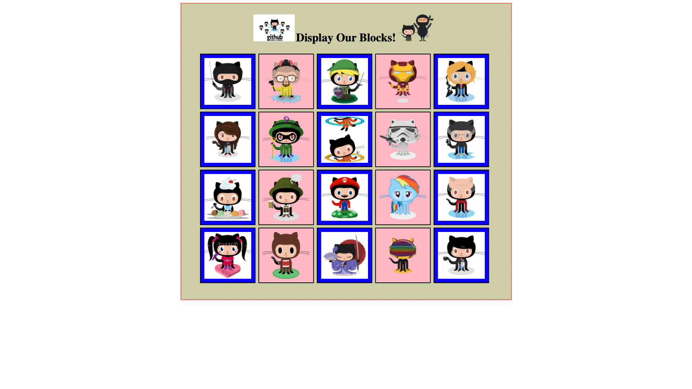

# GitHubCharacters
  A page I created while learning to code at the Coding Dojo. I put into practice the use of a layout by using rows that display images of the github character Octocat into blocks.
# What I learned
  * Practice in HTML/CSS
  * Use of rows as a design layout
  
# Screenshots

